#### Nota: Los scripts .sh los hice para trabajar mas agilmente en el ejercicio 2, solamente compilan y ejecutan

# 1. Comparando las versiones
### Compilando y ejecutando la versión de C
Se compilo el archivo ex1.c de la siguiente manera:

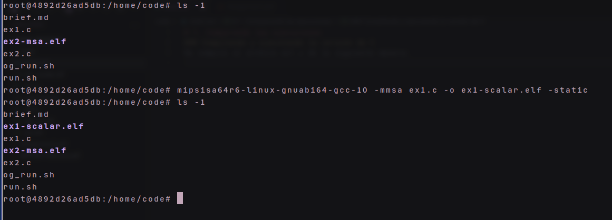

Notemos que no se definen `ADDS_VERSION`, `ADDVI_VERSION` en las flags de compilación.
Por lo que la version compilada es la que esta escrita en C.

Esto produce `ex1-scalar.elf`, el cual se ejecuta a través de QEMU de la siguiente manera:
`qemu-mips64 -cpu I6400 ex1-scalar.elf > ex1-scalar.out`

El output producido se guarda en ex1-scalar.out

Para comprobar que no esta vacio hacemos `head ex1-scalar.out` y obtenemos:
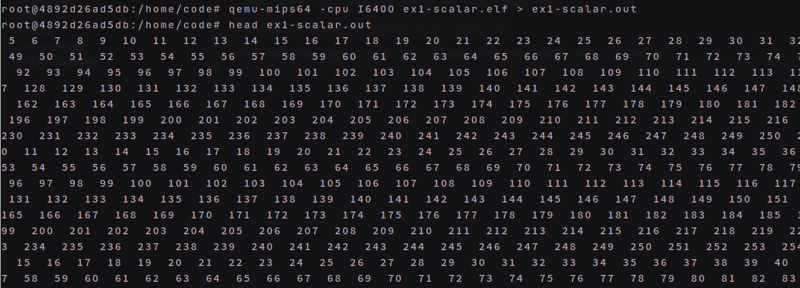

### Compilando y ejecutando la versión de ADDVI
Se compilo el archivo ex1.c de la siguiente manera para que se compile la versión ADDVI:
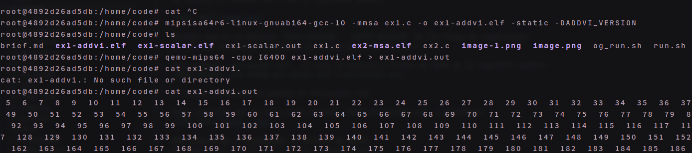

#### Comparemos los resultados de cada uno
Utilizamos `diff` para comparar los archivos `ex1-scalar.out` y `ex1-vector.out` y obtenemos:
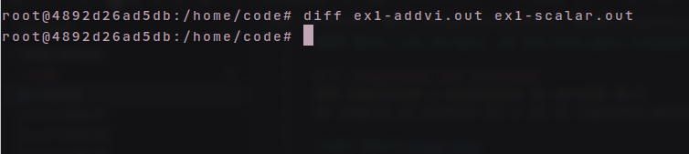
Como no se produjo ningún output, podemos concluir que los resultados son iguales.

### Compilando y ejecutando la versión de ADDS
Se compilo el archivo ex1.c de la siguiente manera para que se compile la versión ADDS:
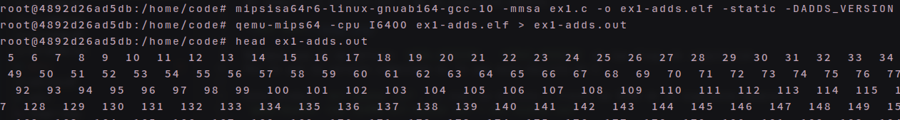

#### Comparemos los resultados con los anteriores
Utilizamos `diff` para comparar los archivos `ex1-adds.out` y `ex1-scalar.out` y obtenemos:
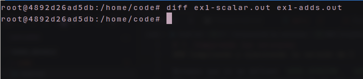
Como no se produjo ningún output, podemos concluir que los resultados son iguales.

### Conclusiones
Podemos concluir que los resultados de las versiones ADDVI, ADDS y la versión en C son iguales.

# 2. Ejercicio 2, reescribir el código en ensamblador con la librería multimedia
Compilamos el archivo ex2.c de la siguiente manera:
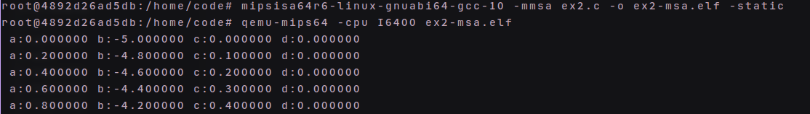
Para volver a ejecutar guardando el output en ex2.out hacemos:
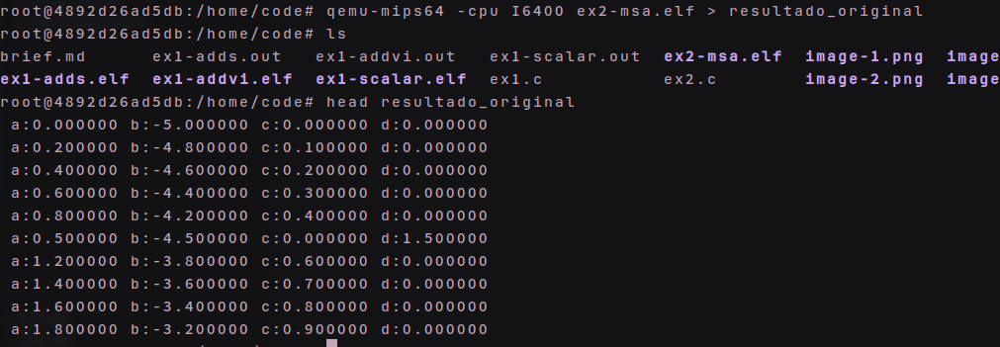

### Desarrollo del código en ensamblador
Primero me asegure de reservar algunos registros para guardar los valores de los vectores y el resultado.
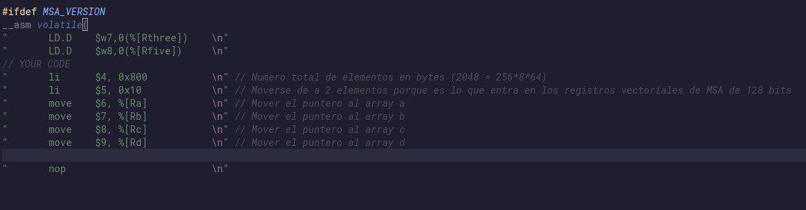

Luego plantee la primera operación de suma de los vectores. Lo hice
sin plantear el loop para poder ver si la suma se realizaba correctamente.
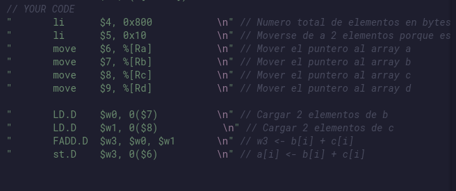
Lo que produce el siguiente output:
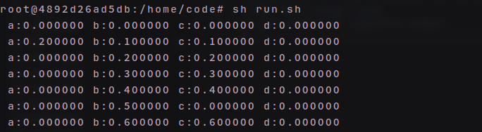
Claramente los dos primeros elementos fueron afectados correctamente.
Sumando B + C y guardando el resultado en A.

Habiendo ganado confianza en la operación de suma, plantee el loop para que se realice la suma de los vectores completos.

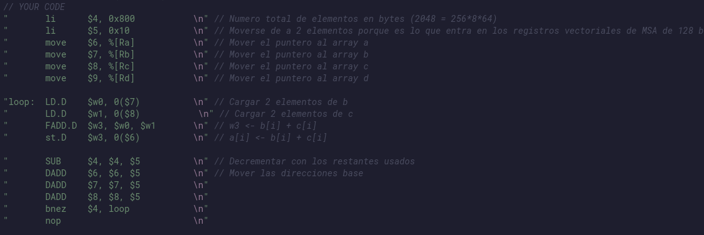
Obteniendo:
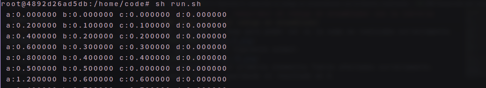

Para comprobar que vamos por el buen camino, la columna de los valores
de `a` ya deberia tener los valores correctos.
Esto se chequea sencillamente de la siguiente manera:

Extraemos la columna de los valores de `a` del resultado del programa compilado desde el código C y los guardamos en el archivo `col1_original.out`.
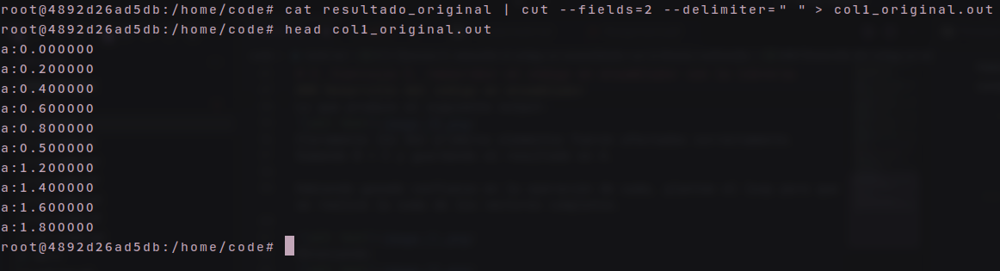

Y ahora extraemos la columna de los valores de `a` del resultado del programa compilado desde el código en ensamblador y los guardamos en el archivo `col1_asm.out`.

Finalmente comparamos ambos archivos con `diff` y obtenemos:
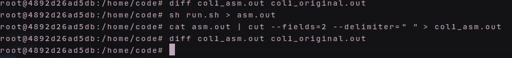

Como no se produjo ningún output, podemos concluir que los resultados son iguales.

Aregando el resto del código en ensamblador...
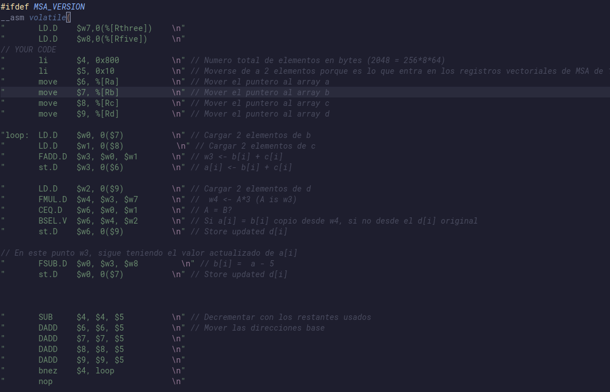

Veamos y comparemos la salida completa de ambos programas:
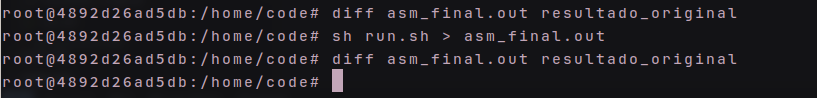

### Conclusiones
Como no se produjo ningún output, podemos concluir que los resultados son iguales.

